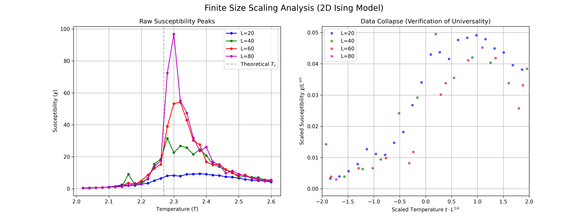

# High-Performance 2D Ising Model Engine (C++ / OpenMP)


**A parallelized Monte Carlo simulation of the 2D Ising Model using the Metropolis-Hastings algorithm.**

Designed for high-performance statistical mechanics simulations, this engine utilizes **OpenMP** and **Checkerboard Decomposition** to achieve **>12x speedup** on multi-core CPUs. It verifies the **2D Ising Universality Class** through finite-size scaling analysis of critical exponents ($\gamma, \nu$).

---

##  Key Features

* **HPC Architecture:** Flattened 1D memory layout for optimal CPU cache locality.
* **Parallelism:** Thread-safe implementation using OpenMP and Red-Black (Checkerboard) domain decomposition.
* **Optimization:** Precomputed Boltzmann lookup tables to bypass expensive transcendental functions.
* **Scientific Accuracy:** Uses **Mersenne Twister (mt19937)** for high-quality entropy (thread-local seeding).
* **Reproducibility:** Fully Dockerized environment for consistent scientific results.

## Scientific Results

### 1. Phase Transition & Universality
The engine successfully reproduces the ferromagnetic phase transition at $T_c \approx 2.27$.

| Finite Size Scaling (Data Collapse) | Phase Ordering Kinetics |
|:-----------------------------------:|:-----------------------:|
|  |  |
| *Collapse of susceptibility curves confirming $\gamma=1.75, \nu=1.0$* | *Spontaneous symmetry breaking (Quench $T=\infty \to 1.0$)* |

### 2. Performance Benchmarks
*System: 12-Core CPU, Lattice Size: $1000 \times 1000$ ($10^6$ spins)*

| Mode | Execution Time (1000 Sweeps) | Speedup |
| :--- | :--- | :--- |
| **Single-Threaded** | 31.55 s | 1.0x |
| **OpenMP (12 Threads)** | **2.55 s** | **12.3x** |

*> Note: Super-linear scaling achieved due to improved effective cache size per thread.*

---

##  Quick Start (Docker)

You can replicate the full simulation and analysis pipeline without installing dependencies.

**1. Build the Container**
```bash
docker build -t ising-hpc .
